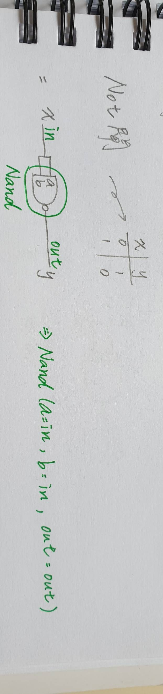

# 1.Not:

## code:

    /**
    * Not gate:
    * out = not in
    */ 
    CHIP Not 
        { IN in;
          OUT out;

        PARTS: 

        // Put your code here:
        Nand(a=in, b=in, out=out);
        }
    
## picture:

# 2.And:

## code:

    /**
     * And gate: 
     * out = 1 if (a == 1 and b == 1)
     *       0 otherwise
     */

    CHIP And {
        IN a, b;
        OUT out;

        PARTS:
        // Put your code here:
        Nand(a=a,b=b,out=AnandB);
        Not(in=AnandB,out=out);
    
picture:

# 3.Or:

## code:

     /**
     * Or gate:
     * out = 1 if (a == 1 or b == 1)
     *       0 otherwise
     */

    CHIP Or {
        IN a, b;
        OUT out;

        PARTS:
        // Put your code here:
        Not(in=a,out=na);
        Not(in=b,out=nb);
        Nand(a=na,b=nb,out=out);
    
## picture:

# 4.Xor:

## code:

    /**
     * Exclusive-or gate:
     * out = not (a == b)
     */

    CHIP Xor {
        IN a, b;
        OUT out;

        PARTS:
        // Put your code here:
        Not(in=a,out=na);
        Not(in=b,out=nb);
        And(a=na,b=b,out=nab);
        And(a=a,b=nb,out=anb);
        Or(a=nab,b=anb,out=out);
    
## picture:

# 5.Mux:

## code:

    /** 
     * Multiplexor:
     * out = a if sel == 0
     *       b otherwise
     */

    CHIP Mux {
        IN a, b, sel;
        OUT out;

        PARTS:
        // Put your code here:
        Not(in=sel,out=nsel);
        And(a=a,b=nsel,out=ansel);
        And(a=b,b=sel,out=bsel);
        Or(a=ansel,b=bsel,out=out); 
    
## picture:

# 6.DMux:

## code:

    /**
     * Demultiplexor:
     * {a, b} = {in, 0} if sel == 0
     *          {0, in} if sel == 1
     */

    CHIP DMux {
        IN in, sel;
        OUT a, b;

        PARTS:
        // Put your code here:
        Not(in=sel, out=nsel);
        And(a=nsel, b=in, out=a);
        And(a=sel, b=in, out=b);
    
## picture:

    
