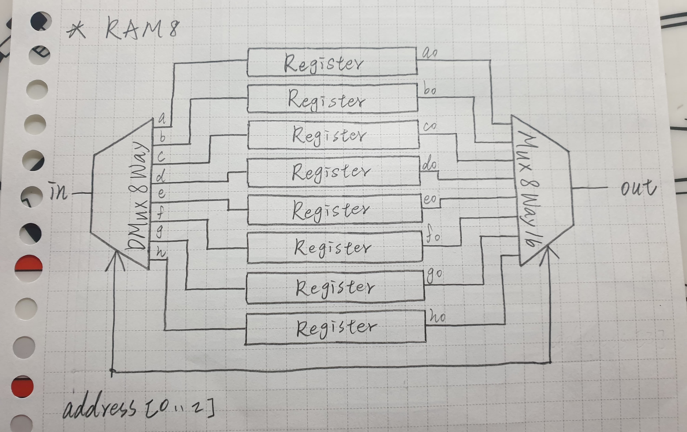
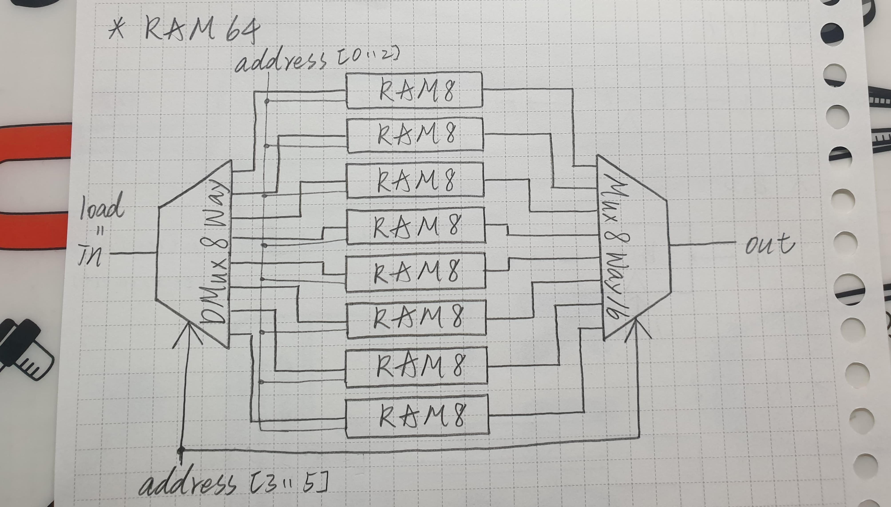
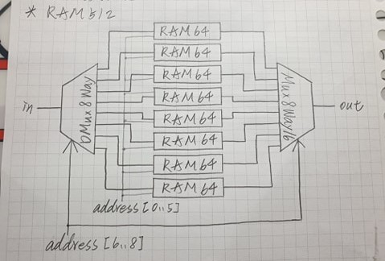
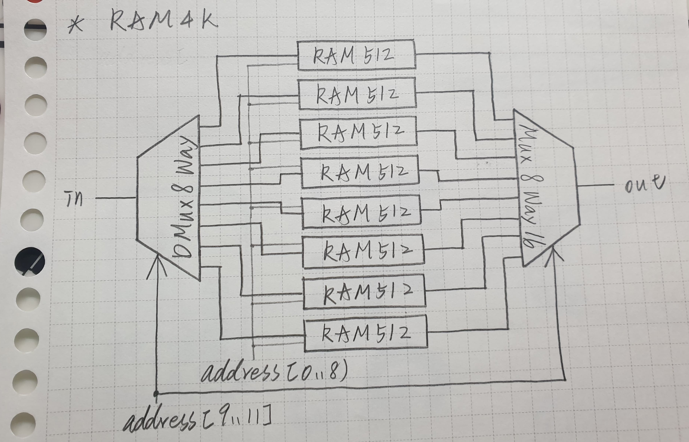
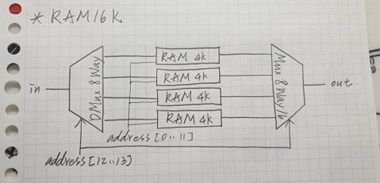

# RAM8:

## code:
          // This file is part of www.nand2tetris.org
          // and the book "The Elements of Computing Systems"
          // by Nisan and Schocken, MIT Press.
          // File name: projects/03/a/RAM8.hdl

          /**
           * Memory of 8 registers, each 16 bit-wide. Out holds the value
           * stored at the memory location specified by address. If load==1, then 
           * the in value is loaded into the memory location specified by address 
           * (the loaded value will be emitted to out from the next time step onward).
           */

          CHIP RAM8 {
              IN in[16], load, address[3];
              OUT out[16];

              PARTS:
              // Put your code here:
              DMux8Way(in=load,sel=address,a=a,b=b,c=c,d=d,e=e,f=f,g=g,h=h);
              Register(in=in,load=a,out=oa);
              Register(in=in,load=b,out=ob);
              Register(in=in,load=c,out=oc);
              Register(in=in,load=d,out=od);
              Register(in=in,load=e,out=oe);
              Register(in=in,load=f,out=of);
              Register(in=in,load=g,out=og);
              Register(in=in,load=h,out=oh);
              Mux8Way16(a=oa,b=ob,c=oc,d=od,e=oe,f=of,g=og,h=oh,sel=address,out=out);
          }

## picture:

# RAM64:

## code:

          // This file is part of www.nand2tetris.org
          // and the book "The Elements of Computing Systems"
          // by Nisan and Schocken, MIT Press.
          // File name: projects/03/a/RAM64.hdl

          /**
           * Memory of 64 registers, each 16 bit-wide. Out holds the value
           * stored at the memory location specified by address. If load==1, then 
           * the in value is loaded into the memory location specified by address 
           * (the loaded value will be emitted to out from the next time step onward).
           */

          CHIP RAM64 {
              IN in[16], load, address[6];
              OUT out[16];

              PARTS:
              // Put your code here:
              DMux8Way(in=load,sel=address[3..5],a=a,b=b,c=c,d=d,e=e,f=f,g=g,h=h);
              RAM8(in=in,load=a,address=address[0..2],out=oa);
              RAM8(in=in,load=b,address=address[0..2],out=ob);
              RAM8(in=in,load=c,address=address[0..2],out=oc);
              RAM8(in=in,load=d,address=address[0..2],out=od);
              RAM8(in=in,load=e,address=address[0..2],out=oe);
              RAM8(in=in,load=f,address=address[0..2],out=of);
              RAM8(in=in,load=g,address=address[0..2],out=og);
              RAM8(in=in,load=h,address=address[0..2],out=oh);
              Mux8Way16(a=oa,b=ob,c=oc,d=od,e=oe,f=of,g=og,h=oh,sel=address[3..5],out=out);
          }

## picture:

# RAM512:

## code:

          // This file is part of the materials accompanying the book 
          // "The Elements of Computing Systems" by Nisan and Schocken, 
          // MIT Press. Book site: www.idc.ac.il/tecs
          // File name: projects/03/b/RAM512.hdl

          /**
           * Memory of 512 registers, each 16 bit-wide. Out holds the value
           * stored at the memory location specified by address. If load==1, then 
           * the in value is loaded into the memory location specified by address 
           * (the loaded value will be emitted to out from the next time step onward).
           */

          CHIP RAM512 {
              IN in[16], load, address[9];
              OUT out[16];

              PARTS:
              // Put your code here:
              DMux8Way(in=load,sel=address[6..8],a=a,b=b,c=c,d=d,e=e,f=f,g=g,h=h);
              RAM64(in=in,load=a,address=address[0..5],out=oa);
              RAM64(in=in,load=b,address=address[0..5],out=ob);
              RAM64(in=in,load=c,address=address[0..5],out=oc);
              RAM64(in=in,load=d,address=address[0..5],out=od);
              RAM64(in=in,load=e,address=address[0..5],out=oe);
              RAM64(in=in,load=f,address=address[0..5],out=of);
              RAM64(in=in,load=g,address=address[0..5],out=og);
              RAM64(in=in,load=h,address=address[0..5],out=oh);
              Mux8Way16(a=oa,b=ob,c=oc,d=od,e=oe,f=of,g=og,h=oh,sel=address[6..8],out=out);
          }

## picture:

# RAM4K:

## code:

          // This file is part of www.nand2tetris.org
          // and the book "The Elements of Computing Systems"
          // by Nisan and Schocken, MIT Press.
          // File name: projects/03/b/RAM4K.hdl

          /**
           * Memory of 4K registers, each 16 bit-wide. Out holds the value
           * stored at the memory location specified by address. If load==1, then 
           * the in value is loaded into the memory location specified by address 
           * (the loaded value will be emitted to out from the next time step onward).
           */

          CHIP RAM4K {
              IN in[16], load, address[12];
              OUT out[16];

              PARTS:
              // Put your code here:
              DMux8Way(in=load,sel=address[9..11],a=a,b=b,c=c,d=d,e=e,f=f,g=g,h=h);
              RAM512(in=in,load=a,address=address[0..8],out=oa);
              RAM512(in=in,load=b,address=address[0..8],out=ob);
              RAM512(in=in,load=c,address=address[0..8],out=oc);
              RAM512(in=in,load=d,address=address[0..8],out=od);
              RAM512(in=in,load=e,address=address[0..8],out=oe);
              RAM512(in=in,load=f,address=address[0..8],out=of);
              RAM512(in=in,load=g,address=address[0..8],out=og);
              RAM512(in=in,load=h,address=address[0..8],out=oh);
              Mux8Way16(a=oa,b=ob,c=oc,d=od,e=oe,f=of,g=og,h=oh,sel=address[9..11],out=out);
          }

## picture:

# RAM16K:

## code:

          // This file is part of www.nand2tetris.org
          // and the book "The Elements of Computing Systems"
          // by Nisan and Schocken, MIT Press.
          // File name: projects/03/b/RAM16K.hdl

          /**
           * Memory of 16K registers, each 16 bit-wide. Out holds the value
           * stored at the memory location specified by address. If load==1, then 
           * the in value is loaded into the memory location specified by address 
           * (the loaded value will be emitted to out from the next time step onward).
           */

          CHIP RAM16K {
              IN in[16], load, address[14];
              OUT out[16];

              PARTS:
              // Put your code here:
              DMux4Way(in=load,sel=address[12..13],a=a,b=b,c=c,d=d);
              RAM4K(in=in,load=a,address=address[0..11],out=oa);
              RAM4K(in=in,load=b,address=address[0..11],out=ob);
              RAM4K(in=in,load=c,address=address[0..11],out=oc);
              RAM4K(in=in,load=d,address=address[0..11],out=od);
              Mux4Way16(a=oa,b=ob,c=oc,d=od,sel=address[12..13],out=out);
          }

## picture:

